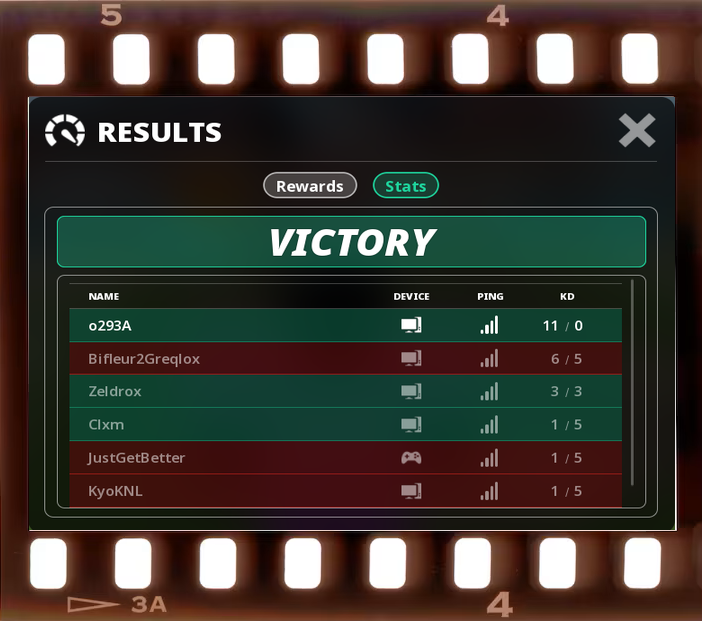

<p align="center">
  
</p>

# ResultsWatcher

A tiny, invisible Windows background program that automatically screenshots the **Roblox RESULTS panel (Stats tab)** at the end of a match.

- Detects the panel on its own, captures **only the panel** (never your whole screen, never the cursor) and saves it as a PNG.
- Confirms with a Discord-style overlay in the middle-right of the screen: `RESULTS FIND / SCREEN` plus a thumbnail of the saved image.
- Goes back to searching as soon as the panel is closed, ready for the next match.
- Quits cleanly when you press **Esc three times**.
- Built to use as few resources as possible while you play.

> **Disclaimer.** This project is not affiliated with, endorsed by, or sponsored by Roblox Corporation. "Roblox" is a trademark of its owner. Use it at your own risk and make sure it complies with the rules of the games you play.

---

## Table of contents

1. [Features](#features)
2. [Download and run](#download-and-run)
3. [Usage](#usage)
4. [Configuration](#configuration)
5. [Output files](#output-files)
6. [Stopping the program](#stopping-the-program)
7. [Run at Windows startup](#run-at-windows-startup)
8. [How it works](#how-it-works)
9. [Performance](#performance)
10. [Safety and anti-cheat](#safety-and-anti-cheat)
11. [Build from source](#build-from-source)
12. [Tests and the debug mode](#tests-and-the-debug-mode)
13. [Project layout](#project-layout)
14. [Known limitations](#known-limitations)
15. [Troubleshooting](#troubleshooting)

---

## Features

| | |
|---|---|
| **Fully invisible** | No window, no console, no taskbar icon, no tray icon, not listed in Alt+Tab. One single process. |
| **Panel only** | Only the exact RESULTS rectangle is read and saved. No full-screen file is ever written, not even a temporary one. |
| **Stats tab only** | A screenshot is taken only when the **Stats** tab is active. Nothing is ever captured on the Rewards tab. |
| **One capture per match** | Waits until the panel is stable and at least one player row is visible, then captures once. |
| **Non-intrusive overlay** | Always on top, clicks and keystrokes pass straight through to the game, never takes focus. |
| **Light on resources** | Event-driven, about 3 checks per second while Roblox is active, zero work while it is not. |
| **Anti-lag design** | Below-normal priority, Windows efficiency mode (EcoQoS), lowest GPU thread priority. |
| **Safe output** | Sequential `1.png`, `2.png`, ... written atomically (temporary file, then rename), never overwriting. |
| **Single instance** | Launching it twice does nothing the second time. |

Works with VICTORY and DEFEAT panels, any number of players (detection never depends on the rows content), windowed and fullscreen-windowed modes.

---

## Download and run

1. Go to the [**Releases**](../../releases) page and download the latest `ResultsWatcher-vX.Y.Z-windows-x64.zip`.
2. Extract it anywhere you like (for example `C:\Tools\ResultsWatcher`).
3. Double-click `ResultsWatcher.exe`.

Nothing appears on screen, and that is expected. Open Roblox, finish a match and stay on the **Stats** tab: a screenshot is saved in the `screens` folder next to the executable and the overlay is shown.

Requirements: Windows 10 (version 2004, build 19041, or later) or Windows 11, 64-bit. No installation and no runtime needed.

To check that it is running, open Task Manager and look for `ResultsWatcher.exe` under *Details*.

---

## Usage

| Step | What happens |
|---|---|
| 1. Start `ResultsWatcher.exe` | It waits silently. |
| 2. Play. The RESULTS panel opens on **Stats** | After about a second of stability, the panel is captured and saved. |
| 3. Overlay | `RESULTS FIND / SCREEN` and a thumbnail appear at the middle-right of the screen. |
| 4. Close the panel | The overlay fades out and the program is ready for the next match. No restart needed. |
| 5. Press **Esc** 3 times | `PROGRAM CLOSED` appears for 2 seconds, then the program exits. |

Other behaviors:

- **Rewards tab:** no capture. Switching to Stats captures if this opening was not captured yet.
- **Switching tabs after a capture:** nothing new is captured while the same panel stays open.
- **New match without closing the panel:** if the banner changes between VICTORY and DEFEAT, or the player table is rebuilt, it counts as a new match and is captured again.
- **Roblox minimized, closed or not in front:** the program sleeps and uses no CPU. It finds the Roblox window again by itself.

---

## Configuration

Everything works without any configuration. To customize, put a `config.toml` file **next to the executable** (a sample is included in the release). Every key is optional.

| Key | Default | Description |
|---|---|---|
| `output_dir` | `"screens"` | Output folder. Relative paths are relative to the executable; absolute paths are allowed. |
| `poll_hz` | `3` | Detection passes per second while Roblox is in front (0.5 to 10). |
| `stable_checks` | `3` | Identical checks required before capturing (2 to 5). |
| `bubble_wait_ms` | `3000` | Maximum wait for the semi-transparent "Season..." bubble to settle before capturing anyway. |
| `close_checks` | `3` | Consecutive "panel not found" checks that mean the panel was closed. |
| `overlay_margin` | `24` | Distance from the right screen edge, in pixels at 1080p (scaled with resolution). |
| `overlay_scale` | `1.0` | Extra size multiplier for the overlay (0.5 to 3). |
| `esc_count` | `3` | Number of Esc presses needed to quit. |
| `esc_max_gap_ms` | `1200` | Maximum delay between two Esc presses. |
| `esc_only_when_roblox_focused` | `false` | If `true`, Esc presses only count while Roblox is the active window. |
| `fallback_search` | `true` | Rare multi-scale search used when the panel is not at its predicted position. |
| `roblox_process` | `"RobloxPlayerBeta.exe"` | Name of the Roblox process to watch. |
| `log_max_kb` | `256` | Maximum size of `watcher.log` before it is rotated. |

---

## Output files

- Screenshots go to the `screens` folder next to the executable (created automatically).
- Files are named `1.png`, `2.png`, `3.png`, ... The numbering continues after the highest number already in the folder. Existing files are never overwritten.
- Each file is written under a temporary name and renamed when complete, so another program watching the folder never reads a half-written image.
- Each image is the exact native-resolution panel, with no cursor and no background.
- A small log is kept in `watcher.log` next to the executable (size-capped and rotated). It is the first place to look if something does not work.

---

## Stopping the program

Press **Esc three times** (distinct presses, at most 1.2 seconds apart). Holding the key down does not count, and 1 or 2 presses do nothing. The overlay then shows `PROGRAM CLOSED` for 2 seconds, fades out, and the process exits with code 0.

The Esc key is never blocked: the game still receives it normally. The key is observed with Windows Raw Input (no hook), so it costs nothing while idle.

By default Esc x3 works even when Roblox is not in front. Set `esc_only_when_roblox_focused = true` to change that.

You can also stop it from PowerShell: `Stop-Process -Name ResultsWatcher`.

---

## Run at Windows startup

Nothing starts automatically unless you ask for it. From the folder containing the executable:

```powershell
.\ResultsWatcher.exe --install-startup     # creates a scheduled task that runs at logon
.\ResultsWatcher.exe --uninstall-startup   # removes it
```

---

## How it works

The program observes the game **from the outside**. It never touches the Roblox process.

### Detection cascade (cheapest first)

1. **Is Roblox the visible foreground window?** If not, everything sleeps. The program is woken by Windows events, not by a loop.
2. **A few dozen pixels** are read at the predicted panel position and tested together: banner color (green or red), dark panel body, turquoise `Stats` pill, grey `Rewards` pill. Several criteria must hold at the same time. Color alone is never enough.
3. **A mini template match** of the header (icon and the `RESULTS` title) on a tiny zone confirms it.
4. **Rarely**, if the predicted position fails but the screen looks like a panel, a multi-scale search runs on the full frame in memory. The result is cached per window size.

The panel position is not hard-coded: it is deduced from the window's client area (vertically centered, horizontally centered plus about 1%).

### Capture

- **DXGI Desktop Duplication** on the monitor hosting Roblox (default). Windows never draws a yellow capture border with this API, whatever the Windows version. The cursor is not part of the duplicated image, and the overlay window is excluded from capture.
- Optional: `capture = "window"` or `capture = "monitor"` in `config.toml` selects Windows Graphics Capture instead (a yellow border may appear). It is also used automatically if Desktop Duplication keeps failing.
- Only tiny rectangles are copied from the GPU texture to the CPU for the tests. The full panel is read exactly once, at the final capture.
- If window capture fails, it falls back to capturing the monitor and cropping the panel immediately in memory. The full screen is never written to disk.
- PNG encoding runs on a separate low-priority thread.

### State machine

`SEARCHING` -> `STABILIZING` (panel and Stats tab stable for a few checks, at least one player row visible, waiting for the "Season..." bubble to settle for up to 3 seconds) -> `CAPTURED` (one capture, overlay shown) -> `CLOSING` (panel absent for 3 checks, overlay fades out) -> `SEARCHING`.

### Overlay

A borderless layered window (`WS_EX_LAYERED`, `TOPMOST`, `TOOLWINDOW`, `NOACTIVATE`, `TRANSPARENT`) with per-pixel alpha, rendered at the middle-right of the monitor that hosts Roblox. It is transparent to the mouse, so clicking on it clicks the game underneath. It is re-asserted on top every second so it stays above fullscreen-windowed games.

---

## Performance

The design goals are:

| Situation | Goal |
|---|---|
| Roblox not active | About 0% CPU: no timer, no capture session, the program is blocked waiting for Windows events. |
| Searching | Under 1% CPU and a few MB of RAM, no noticeable impact on game performance. |

How the program gets there: event-driven wake-ups, about 3 checks per second, a few dozen pixels per check, a single small staging texture reused for every read, no heavy image library (no OpenCV), below-normal process priority, EcoQoS, lowest GPU thread priority, and a release build with LTO, `panic = "abort"` and stripped symbols.

These are design goals. To measure on your own machine, open Task Manager, go to *Details*, and watch `ResultsWatcher.exe` (CPU, memory, GPU engine columns) while Roblox is in front.

---

## Safety and anti-cheat

- The program only uses **external screen capture** (Desktop Duplication) and a **separate overlay window**.
- It does **not** inject DLLs, hook into Roblox, read its memory, or draw inside its rendering.
- The only system hook is a `SetWinEventHook` notification subscription (out-of-process): Windows calls back into the program itself; nothing is loaded into Roblox.
- Esc is observed with Raw Input and is never blocked or modified.
- It makes no network connection.

There is no guarantee about how any game's anti-cheat or terms of service treat third-party software. Use it at your own risk.

---

## Build from source

### Requirements

- Windows 10/11, 64-bit
- [Rust](https://rustup.rs/) (stable) with the `x86_64-pc-windows-msvc` target (the default on Windows)
- Visual Studio Build Tools with the "Desktop development with C++" workload (required by Rust's MSVC toolchain)

### Steps

```powershell
git clone https://github.com/YOUR-USERNAME/ResultsWatcher.git
cd ResultsWatcher
cargo build --release
```

The executable is created at `target\release\ResultsWatcher.exe`. It is a single self-contained file.

To run it: `.\target\release\ResultsWatcher.exe`

---

## Tests and the debug mode

```powershell
cargo test --release
```

The tests cover the pure logic: geometry and scale, the detection cascade on reference images (victory, defeat, windowed, cropped panel), robustness to a simulated mouse cursor and a simulated "Season..." bubble, false-positive protection, the state machine, the Esc x3 counter, configuration parsing, atomic sequential PNG output and overlay rendering. The reference images in `tests/fixtures` are cropped to the panel and have player names removed.

The Windows-specific parts (capture, overlay, Raw Input) are not covered by automated tests.

### Debug mode

Run the detection on any PNG without capturing anything on screen:

```powershell
.\ResultsWatcher.exe --debug-image path\to\screenshot.png
.\ResultsWatcher.exe --debug-image path\to\screenshot.png --client 0,23,1920,1009
```

It prints the panel position and size, the deduced scale, the active tab, the banner type (Victory or Defeat) and whether player rows are visible. `--client x,y,w,h` describes the game client area inside the image when the screenshot includes a window title bar.

Because the executable uses the Windows GUI subsystem, PowerShell may print the result after the prompt returns. To keep the output in order, pipe the command: `.\ResultsWatcher.exe --debug-image shot.png | Out-Null`.

---

## Project layout

```
ResultsWatcher/
|-- Cargo.toml              Project and release profile (LTO, strip, panic=abort)
|-- Cargo.lock              Locked dependency versions
|-- config.toml             Sample configuration (optional)
|-- README.md
|-- src/
|   |-- main.rs             Entry point (GUI subsystem, no console)
|   |-- lib.rs              Module list
|   |-- geometry.rs         Panel geometry, scale candidates, overlay layout
|   |-- pixels.rs           Image type, color classification
|   |-- detect.rs           Detection cascade (pixel test, template, fallback search)
|   |-- template.rs         Header template (icon and title)
|   |-- state.rs            State machine
|   |-- esc.rs              Esc x3 counter
|   |-- config.rs           config.toml parser
|   |-- png_out.rs          Sequential atomic PNG writer
|   |-- render.rs           Overlay compositing (rounded rectangle, thumbnail)
|   |-- logger.rs           Size-capped log file
|   |-- debug_image.rs      --debug-image mode
|   `-- win/                Windows-only code
|       |-- app.rs          Event loop, WinEvent hook, Raw Input, orchestration
|       |-- capture.rs      Windows Graphics Capture and Direct3D 11 readback
|       |-- overlay.rs      Layered click-through overlay window
|       `-- util.rs         Process tuning, window geometry, helpers
`-- tests/
    |-- pure.rs             Unit and integration tests
    `-- fixtures/           Reference images
```

---

## Known limitations

- **Tested resolution:** developed and verified on 1920x1080 (fullscreen-windowed and windowed). Other resolutions and aspect ratios use a deduced scale and a fallback search, but were not verified on real captures.
- **Exclusive fullscreen:** capture falls back to the whole monitor (cropped in memory), but the overlay may not be visible above an exclusive-fullscreen game. Fullscreen-windowed (the Roblox default) is fully supported.
- **Capture border:** none in the default mode (Desktop Duplication). The yellow border only exists with Windows Graphics Capture, which is now only a fallback.
- **The "Season..." bubble:** it is part of the game's own rendering and cannot be removed from the capture. The program waits for it to settle (up to 3 seconds) and then captures anyway.
- **Tab switching:** the program assumes the panel header is identical on the Rewards tab, which it uses only to tell a tab switch from a closed panel.
- **Language and theme:** detection relies on colors and layout, not on text, but a future Roblox UI redesign would require updating the measured geometry in `src/geometry.rs`.

---

## Troubleshooting

**Nothing is captured.**
Check `watcher.log` next to the executable. It should contain `start`, then `saved ...` after a capture. Make sure the panel is on the **Stats** tab and stays open for a couple of seconds.

**Store version of Roblox or a different process name.**
Find the real process name while Roblox is open:

```powershell
Get-Process | Where-Object { $_.MainWindowTitle -eq "Roblox" } | Select-Object ProcessName
```

Then create `config.toml` next to the executable with `roblox_process = "TheName.exe"`.

**The overlay does not appear above my game.**
It works above fullscreen-windowed. In exclusive fullscreen it may not be visible, while captures continue.

**I want to stop it right now.**
Press Esc three times, or run `Stop-Process -Name ResultsWatcher`.

**Windows SmartScreen warns about the executable.**
The executable is not code-signed, so Windows may show an "unknown publisher" warning. You can inspect the source and build it yourself.